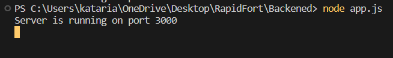
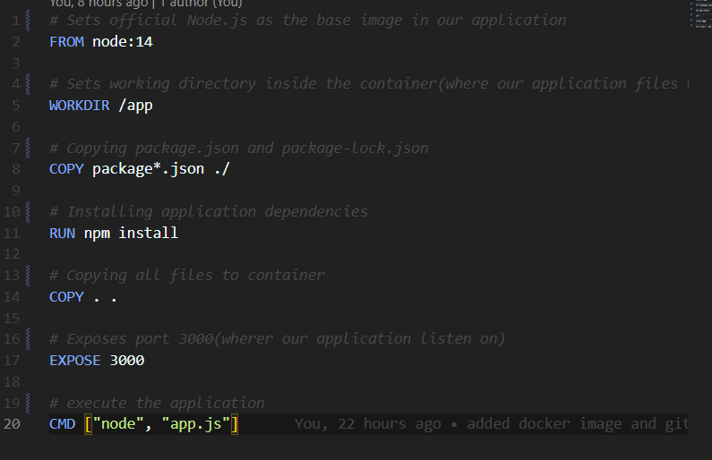
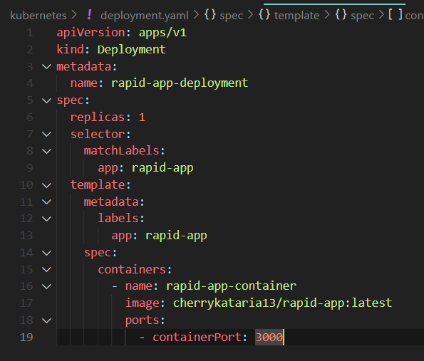
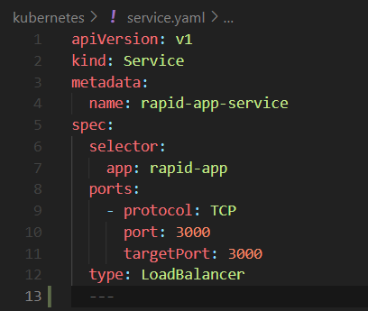
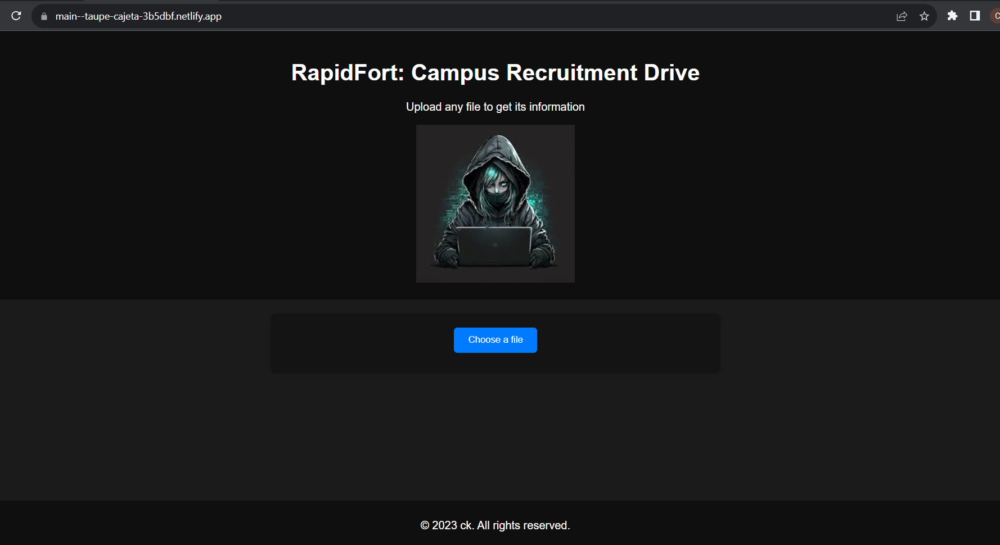
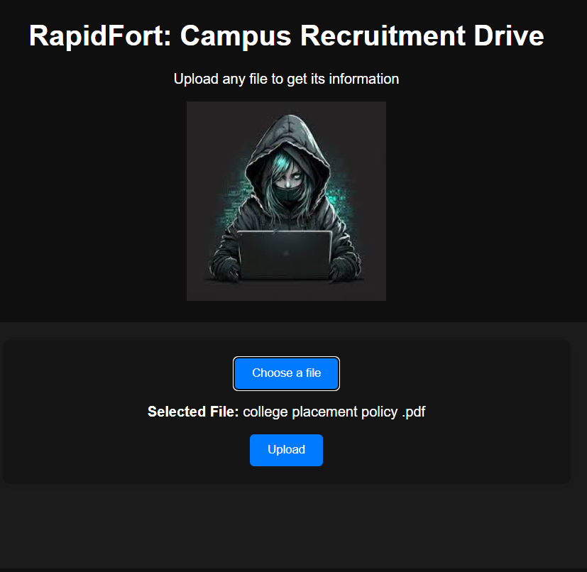
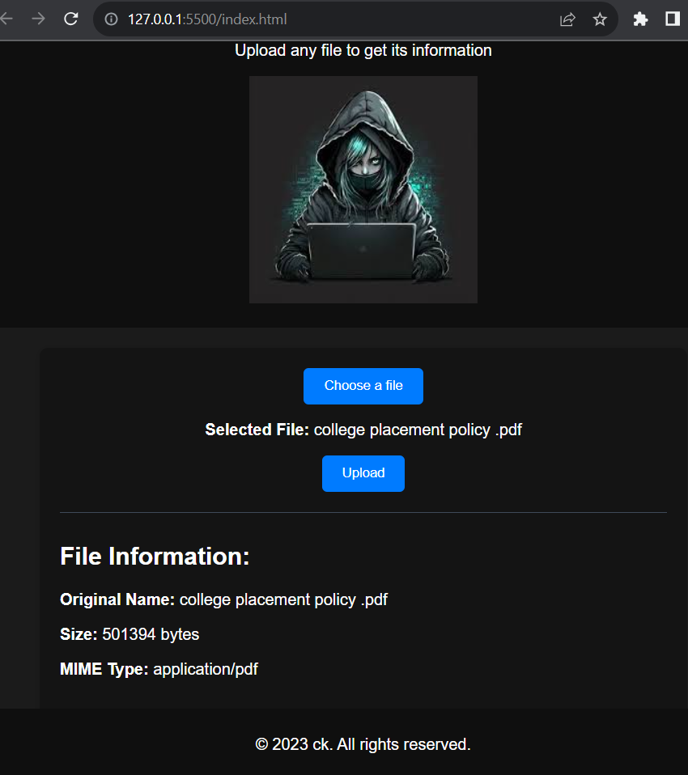

# Rapidfort: Campus Recruitment Drive
## Project Name: File Upload and Information Retrieval Web Server

### Project Overview

### Project Link: 
- Project Repository: https://github.com/cherrykataria13/Rapidfort-backend
- Frontend Repository: https://github.com/cherrykataria13/Frontend
- Deployed Live project: https://main--taupe-cajeta-3b5dbf.netlify.app/

### Discription : 
This project involves building a REST API-based web server for seamless file management. The primary goal is to create a user-friendly interface enabling easy file uploads while providing comprehensive insights about uploaded files. Clear API endpoints and REST methodology ensure smooth communication, supporting methods like GET and POST. The project also integrates CI/CD pipelines with Docker, automating application building, testing, and deployment. Furthermore, the implementation includes streamlined Docker container execution through bash scripts and explores Kubernetes deployment, configuring application management within a dynamic Kubernetes cluster.

### Project Objectives :
1.	REST API-based Web Server: The core objective is to build a web server that communicates using REST APIs. This server should be capable of handling file uploads and providing information about the uploaded files.
2.	API Definition and Clarity of REST: It defines API endpoints very clearly. It also explains how the API works, and whatever methods we have used like GET, POST and how data should be formatted in requests and responses.
3.	Simple UI Integration: Develop a user interface that makes it easy for users to interact with the web server. This could be a web page where users can upload files and view information about them.
4.	CI/CD pipelines with Docker: It sets up a continuous integration/deployment pipeline. This means automating the process of building, testing and deploying applications. In this case, the focus is on building Docker containers as part of the pipeline.
5.	Run Docker containers: Create bash scripts that simplify the process of running Docker containers. This script should do things like build the container image and start the container with the desired configuration.
6.	Kubernetes deployment: Create a configuration file (usually in YAML format) to deploy your web server to a Kubernetes cluster. These files define how applications are managed in the Kubernetes environment.

## Implementation Steps

### 1. Backend Development

- Set up an Express server in the `app.js` file to handle file uploads and responses.
- Install required dependencies using `npm install express multer mime-types`.
- Test the backend by running `node app.js` and sending requests to endpoints.

### 2. Docker Containerization

- Create a Dockerfile to define the containerization process.
- Build the Docker image with `docker build -t rapid-backend .`.
- Utilize GitHub Actions to automate Docker image building and push.

Dockerfile

### 3. Kubernetes Deployment

- Define Kubernetes deployment and service configurations in `deployment.yaml` and `service.yaml`.
- Deploy the backend to Kubernetes using `kubectl apply`.

deployment.yaml    

service.yaml    

### 4. Frontend Development

- Develop frontend UI with HTML, JavaScript, and CSS.
- Host frontend files on a web server or static hosting service.
- Interact with the hosted UI to upload files and retrieve information.

File Upload : User can upload the file by clicking choose a file button.

Display the name of the selected file.

Retrivinfg information of the selected file by clicking upload button.

